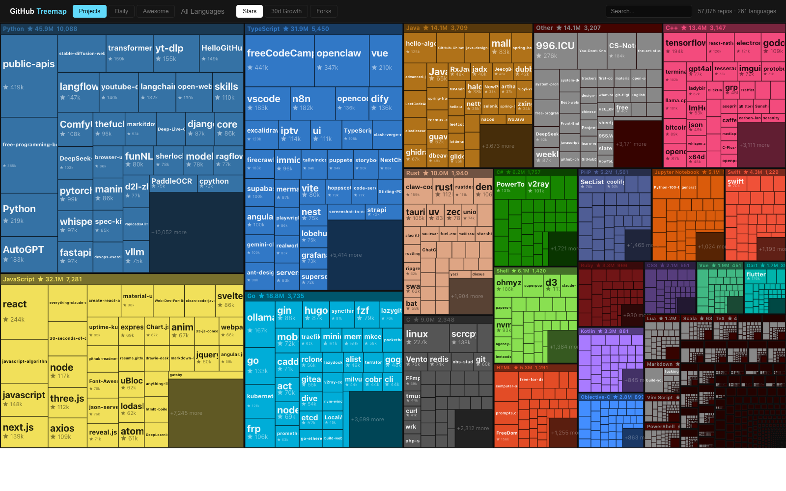

# 1k GitHub Stars

Interactive treemap of 60k+ GitHub repositories — 每日趋势、Awesome/Guide 内容聚合、按语言深度探索。

Live site: [https://ustars.dev](https://ustars.dev)



## What it does

- **Projects tab**: default repo map, with curated/guide-style repositories filtered out
- **Daily tab**: highlights momentum using star-growth deltas from the latest snapshot
- **Awesome tab**: brings back the filtered awesome / guide / tutorial / interview style repositories as a dedicated view
- **Language drill-down**: click any language block to zoom into that language only
- **Hover metadata**: repo created/updated dates are loaded from a static index instead of per-hover API calls

## Data model

The app is driven by a single snapshot file:

- `data/repos.json` — main repo dataset
- `public/repo-meta.json` — lightweight hover metadata index

Each repo row currently stores:

1. `fullName`
2. `stars`
3. `forks`
4. `langIdx`
5. `description`
6. `growth`
7. `createdAt`
8. `updatedAt`

## Refreshing GitHub data

Use the refresh script:

```bash
npm run refresh:growth
```

What it does:

- refreshes stars / forks / timestamps from GitHub
- computes `growth` against the previous local snapshot
- writes a resumable progress file during long runs
- snapshots the previous dataset into `data/snapshots/`
- regenerates `public/repo-meta.json`

## Local development

```bash
npm install
npm run dev
```

Open:

- `http://localhost:3000`

## Build

```bash
npm run build
```

This project is configured as a **static export**.

## Cloudflare Pages deployment

The current deployment path is Cloudflare Pages:

```bash
npm run build
npx wrangler pages deploy out --project-name github-treemap --branch main
```

## Repository structure

```txt
app/                  Next.js App Router pages
components/           treemap canvas, header, tooltip, panel
data/                 repo snapshot data
lib/                  grouping, filtering, classifier, metrics
public/repo-meta.json static hover metadata index
scripts/              data refresh scripts
```

## Notes

- The project intentionally separates the main treemap data from hover metadata to reduce runtime latency and avoid per-hover server/API requests.
- Curated repositories are filtered at the data layer, not only in the UI, so homepage / language pages / daily view stay consistent.
