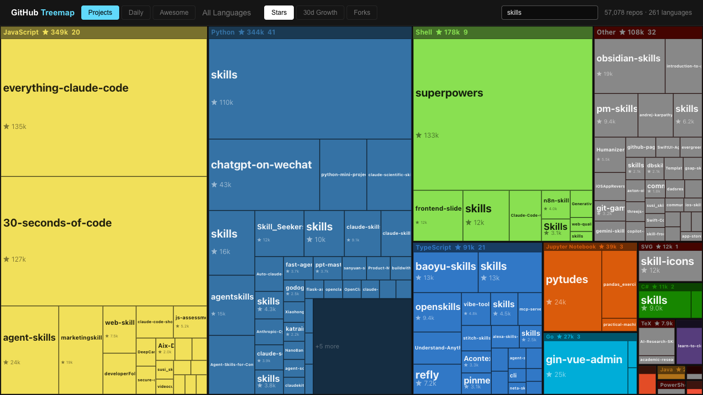

# 1k GitHub Stars

[](https://github.com/xiaoxiunique/1k-github-stars/stargazers)
[](https://github.com/xiaoxiunique/1k-github-stars/commits/main)
[](https://nextjs.org/)

Interactive treemap of 60k+ GitHub repositories with daily momentum, curated discovery, and language-level exploration.

**Live site:** <https://ustars.dev>

## Table of Contents

- [What it does](#what-it-does)
- [Screenshots](#screenshots)
- [How it works](#how-it-works)
- [Quick start](#quick-start)
- [Data refresh](#data-refresh)
- [Build and deploy](#build-and-deploy)
- [Project structure](#project-structure)
- [Notes](#notes)

## What it does

1k GitHub Stars helps you explore a large GitHub dataset visually instead of scrolling endless ranking lists.

### Highlights

- **Projects tab** for the default repository map.
- **Daily tab** for recent momentum using star-growth deltas.
- **Awesome tab** for curated and guide-style repositories.
- **Language drill-down** to zoom into a single language.
- **Search** across name, description, and language labels.
- **Hover metadata** loaded from a static index for faster interaction.

## Screenshots

### Homepage overview


### Search example



## How it works

The app is driven by two primary data artifacts:

- `data/repos.json` for the main repository snapshot
- `public/repo-meta.json` for lightweight hover metadata

Each repo record currently stores:

1. `fullName`
2. `stars`
3. `forks`
4. `langIdx`
5. `description`
6. `growth`
7. `createdAt`
8. `updatedAt`

## Quick start

### Prerequisites

- Node.js
- npm

### Install dependencies

```bash
npm install
```

### Start local development

```bash
npm run dev
```

Then open <http://localhost:3000>.

## Data refresh

Refresh GitHub growth data with:

```bash
npm run refresh:growth
```

This script:

- refreshes stars, forks, and timestamps from GitHub
- computes `growth` against the previous local snapshot
- writes a resumable progress file during long runs
- snapshots the previous dataset into `data/snapshots/`
- regenerates `public/repo-meta.json`

## Build and deploy

### Production build

```bash
npm run build
```

This project is configured as a static export.

### Cloudflare Pages

```bash
npm run build
npx wrangler pages deploy out --project-name github-treemap --branch main
```

## Project structure

```text
app/                  Next.js App Router pages
components/           treemap canvas, header, tooltip, panel
data/                 repo snapshot data
lib/                  grouping, filtering, classifier, metrics
public/repo-meta.json static hover metadata index
scripts/              data refresh scripts
```

## Notes

- The project separates main treemap data from hover metadata to reduce runtime latency.
- Curated repositories are filtered in the data layer, not only in the UI.
